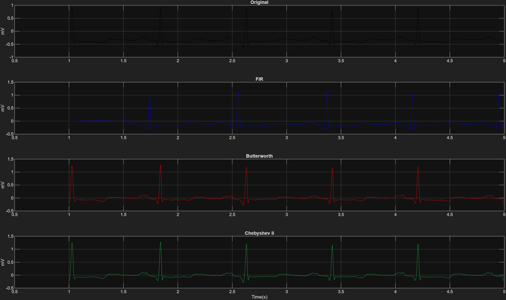

# ECG Denoising Project

This project implements digital signal processing techniques for denoising ECG signals using the MIT-BIH Arrhythmia Database.

## Preview

## Analysis Figures
The full set of 16 analysis figures (Frequency Response, Pole-Zero, PSD, etc.) can be found in the `figures/` directory.

## Features
- **FIR Filter**: Hamming window based FIR filter implementation.
- **IIR Filters**: Butterworth and Chebyshev Type II implementations.
- **Analysis**: Frequency response, pole-zero plots, PSD analysis, and SNR calculations.
- **Visualization**: Tabbed viewer for multiple plots and automatic PNG export.

## How to Run
Run `ecg_denoising.m` in MATLAB.

## Requirements
- MATLAB
- Signal Processing Toolbox
