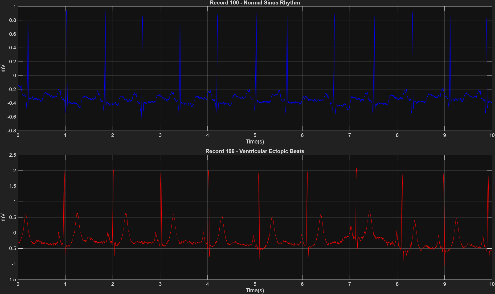
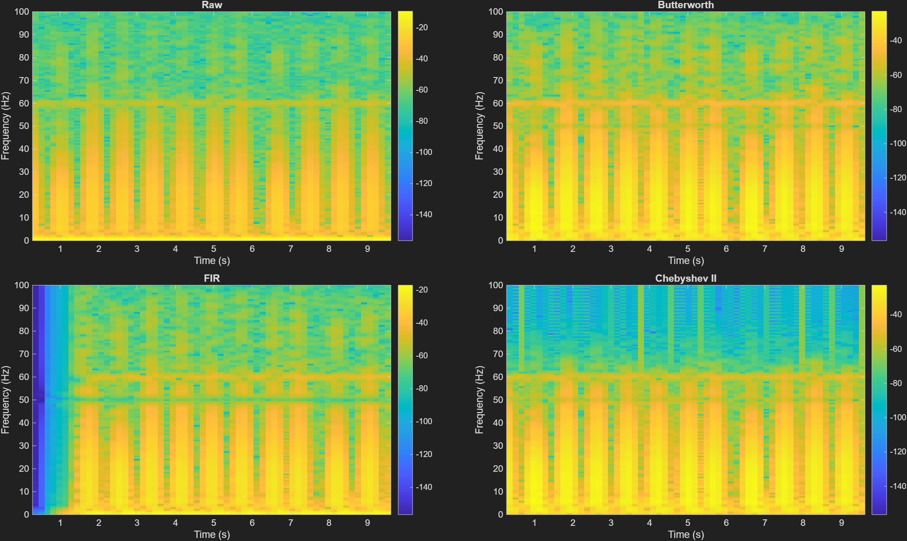

# ECG Denoising: Digital Signal Processing Concepts

> **Learning Guide:** Before we touch the code, let's build up every concept you need from absolute zero. This document breaks down the foundational Digital Signal Processing (DSP) concepts required to understand ECG filtering. We assume no prior knowledge, defining core terminology as we go.

---

## 1.1 The Foundation: What is an ECG Signal?

An **ECG (Electrocardiogram)** is a recording of the electrical activity of the heart. Electrodes on your skin pick up tiny voltage changes (millivolts) as the heart muscles contract and relax. To analyze this on a computer, the continuous physical signal must undergo **Sampling** and **Quantization**.

*   **Sampling:** In the real world, signals like sound or heartbeats are continuous (Analog). Computers can only understand discrete numbers. Sampling is the process of taking "snapshots" or measuring the continuous signal at regular time intervals. 
*   **Quantization:** After sampling, Quantization assigns a specific numerical value to the signal's amplitude at that moment. Our ECG uses an 11-bit resolution, meaning it can represent the voltage using 2,048 different discrete levels.

A single heartbeat produces a characteristic waveform with labeled parts:
- **P-wave**: the atria (upper chambers) contracting
- **QRS complex**: the ventricles (lower chambers) contracting — this is the tall, sharp spike
- **T-wave**: the ventricles relaxing

The **QRS complex** is the most important feature for diagnosis. It's sharp, fast, and contains **frequencies** up to about 30–40 Hz. 
*   **Frequency (Hz):** Frequency measures how often something repeats over time, measured in Hertz (Hz). 1 Hz means 1 cycle per second. In our ECG, the heart beats roughly 1-2 times per second (1-2 Hz).

**Our data** comes from the MIT-BIH Arrhythmia Database:
- **Record 100**: Normal sinus rhythm (healthy heartbeat)
- **Record 106**: Contains PVCs (Premature Ventricular Contractions) — abnormal early beats with a different shape

---

## 1.2 What is "Sampling Frequency" and "Nyquist"?

**Sampling frequency (fs)**: How many measurements per second. Our ECG signals are sampled at **fs = 360 Hz**, meaning the equipment measures the voltage 360 times per second.

**Nyquist frequency**: Exactly half of fs. For us: 360/2 = **180 Hz**. This is the highest frequency that our digital system can possibly represent. Any frequency above 180 Hz simply cannot exist in our digital data.

**Why this matters**: When we design filters in MATLAB, all frequencies must be expressed as a fraction of the Nyquist frequency. This is called **normalized frequency**. For example:
- 0.5 Hz becomes `0.5 / 180 = 0.00278`
- 50 Hz becomes `50 / 180 = 0.2778`
- 100 Hz becomes `100 / 180 = 0.5556`

This is why you see `0.5/(fs/2)` everywhere in the code — it's converting real Hz to normalized.

---

## 1.3 The Three Noises Contaminating ECG

When electrodes record the heart, they also pick up three types of unwanted interference. We call this unwanted data **Noise**.

### Noise 1: Baseline Wander (< 0.5 Hz)
- **Source**: The patient breathes, and the chest moves. The electrodes shift slightly.
- **What it looks like**: The entire ECG trace slowly drifts up and down over several seconds.
- **Frequency**: Very slow — below 0.5 Hz (less than one full cycle every 2 seconds).
- **Why it's bad**: It makes the trace "wander" vertically. A doctor might mistake the drift for an ST-segment elevation (which indicates a heart attack).

### Noise 2: Power-line Interference (50 Hz)
- **Source**: The electrical wiring in the walls radiates electromagnetic fields at 50 Hz (the mains frequency in many countries). The ECG cables act like antennas.
- **What it looks like**: A fast sinusoidal ripple sitting on top of the ECG.
- **Frequency**: Exactly 50 Hz.
- **Why it's bad**: It adds a visible buzz to the trace, masking the smaller P-wave and T-wave.

### Noise 3: EMG / Muscle Noise (20–150 Hz)
- **Source**: Skeletal muscles near the electrodes (arms, chest) fire random electrical signals.
- **What it looks like**: High-frequency fuzz/static that makes the trace look "hairy."
- **Frequency**: Spread across 20–150 Hz, but we only care about removing the part **above 100 Hz** because vital ECG content goes up to ~100 Hz.
- **Why it's bad**: It buries the fine details of the QRS complex.


*Figure 1: The Raw ECG signal before any denoising. You can see the slow baseline wander (drifting) and the high-frequency fuzziness (EMG/Powerline noise).*

### Our Strategy: Three Filters in a Row

```
Raw ECG → [High-Pass at 0.5 Hz] → [Notch at 50 Hz] → [Low-Pass at 100 Hz] → Clean ECG
             kills baseline            kills power          kills EMG
             wander                     line hum             muscle noise
```

---

## 1.4 What is a Digital Filter?

A digital filter is a mathematical operation that takes your signal (a list of numbers) and produces a new list of numbers where certain frequencies have been amplified or suppressed. Think of it like a coffee filter: it lets the good stuff (the diagnostic heart signal) through while blocking the bad stuff (the noise).

Every digital filter is defined by a **difference equation**:

```
y[n] = b₀·x[n] + b₁·x[n-1] + b₂·x[n-2] + ...
       - a₁·y[n-1] - a₂·y[n-2] - ...
```

- `x[n]` = current input sample
- `y[n]` = current output sample
- `b` coefficients = **feedforward** (they look at current and past inputs)
- `a` coefficients = **feedback** (they look at past outputs)

This is where the two main filter families come from.

---

## 1.5 FIR vs IIR Filters

There are two main families of digital filters. We implemented both to compare their performance.

### FIR = Finite Impulse Response

An FIR filter **only has `b` coefficients**. The `a` side is just `a₀ = 1` (no feedback). The equation becomes:

```
y[n] = b₀·x[n] + b₁·x[n-1] + b₂·x[n-2] + ... + bₙ·x[n-N]
```

- It only looks at the current and past **N input** values. It never looks at its own past outputs.
- If you feed in a single impulse (one spike followed by silence), the output will eventually reach zero after exactly N+1 samples. That's why it's "Finite."

**Key properties**:
- ✅ **Always stable**: Since there's no feedback, it can never oscillate or blow up.
- ✅ **Linear phase**: When a filter processes a signal, it delays it slightly. If all frequencies are delayed by the exact same amount of time, the filter has "Linear phase". The waveform shape is perfectly preserved — just shifted in time.
- ❌ **Needs many taps (High Filter Order)**: To get a sharp cutoff at low frequencies (like 0.5 Hz when fs=360), you need hundreds of coefficients (our code uses 500).

### IIR = Infinite Impulse Response

An IIR filter **has both `b` and `a` coefficients**. The equation has feedback:

```
y[n] = b₀·x[n] + b₁·x[n-1] ... - a₁·y[n-1] - a₂·y[n-2] ...
```

- It looks at past **outputs** too. This feedback creates a recursive loop.
- If you feed in a single impulse, the output theoretically never reaches exactly zero — it decays exponentially forever. That's why it's "Infinite."

**Key properties**:
- ✅ **Very efficient**: A 4th-order IIR can match the sharpness of a 500-tap FIR.
- ❌ **Can be unstable**: If the feedback coefficients are wrong, the output can grow without bound.
- ❌ **Non-linear phase**: Different frequencies get delayed by different amounts, which distorts the waveform shape. (We fix this with `filtfilt` — explained below).

---

## 1.6 The Three IIR Filter Designs in Our Project

### Butterworth
- **Philosophy**: "Maximally flat" in the passband. The magnitude response is as smooth as possible — no ripples, no bumps. It just gradually rolls off.
- **Trade-off**: Because it refuses to ripple, its transition from passband to stopband is wider (gentler slope) compared to other designs at the same order.
- **In our code**: `butter(4, ...)` — 4th order.

### Chebyshev Type II
- **Philosophy**: Allow controlled **ripple** in the **stopband** (the region you're blocking) to get a **sharper transition** than Butterworth. Ripples are small fluctuations or bouncing in the frequency response.
- **Passband**: Completely flat (monotonic) — no ripple where your signal lives.
- **Stopband**: Has an equiripple pattern, but the ripples never exceed a guaranteed minimum attenuation (we set Rs=40 dB, meaning the noise is at least 10,000× weaker in power).
- **Why Type II and not Type I?** Type I has ripple in the passband, which would distort our ECG. Type II puts the ripple in the stopband where we don't care.
- **In our code**: `cheby2(4, 40, ...)` — 4th order, 40 dB stopband attenuation.

### iirnotch (Used for the 50 Hz Notch)
- A specialized 2nd-order IIR filter that creates a very narrow "notch" (dip) at exactly one frequency.
- **Q-factor = 30**: Controls the width. Higher Q = narrower notch. Q=30 means only about 50 ± 0.83 Hz is removed. Everything else passes unchanged.
- Used for both Butterworth and Chebyshev sets because it's already the most efficient design for a single-frequency notch.


*Figure 2: The Spectrogram shows Frequency on the Y-axis and Time on the X-axis. Bright colors indicate high energy. Notice the bright horizontal line at 50 Hz in the 'Raw' plot (Powerline noise). In the filtered plots (Butterworth, FIR, Chebyshev), that 50 Hz line is completely erased by our Notch filter.*

---

## 1.7 The Hamming Window (FIR Design Method)

To design an FIR filter, MATLAB's `fir1` function:
1. Starts with an **ideal filter** (a perfect brick wall that passes everything below the cutoff and blocks everything above).
2. Computes the ideal filter's impulse response — mathematically, it's a **sinc function** (sin(x)/x), which is infinitely long.
3. **Truncates** it to N+1 samples (since we can't have infinite coefficients).
4. The abrupt truncation creates ugly artifacts: the frequency response develops "ringing" oscillations near the cutoff, called **Gibbs phenomenon**.
5. To fix this, we multiply the truncated impulse response by a **window function** that smoothly tapers the edges to zero.

**The Hamming window** is one specific window shape. It:
- Suppresses sidelobes to about **-53 dB** (good for ECG where we need ~40 dB suppression).
- Has a reasonably narrow main lobe (the transition band isn't too wide).
- Is a good all-around choice — not the best at any one thing, but solid at everything.

---

## 1.8 Linear Phase vs Zero-Phase Filtering

### Linear Phase (FIR)
- A linear-phase filter delays all frequencies by exactly the same amount: **(N)/2 samples**.
- The waveform shape is perfectly preserved — it's just shifted to the right in time.
- Our FIR cascade has total delay = (500 + 500 + 100)/2 = **550 samples ≈ 1.53 seconds**.
- You can see this shift in the QRS Zoom tab.

### Zero-Phase (filtfilt with IIR)
- `filtfilt` is a MATLAB trick: it filters the signal **forward**, then **flips the signal and filters it again backward**.
- The forward pass introduces a phase shift; the backward pass introduces the exact opposite phase shift. They cancel out → **zero phase distortion**.
- The output is not shifted at all — the QRS peaks stay in exactly the right place.
- **Catch**: You need the **entire signal** before you start. You can't do this in real-time (you'd need future samples). This is fine for offline analysis but impossible for a live heart monitor.
- **Bonus**: It also doubles the effective filter order (a 4th-order Butterworth becomes effectively 8th-order after filtfilt).

---

## 1.9 Power Spectral Density (PSD) — Welch Method

**PSD** tells you how much power (energy) your signal has at each frequency. It's like an X-ray of the signal's frequency content.

**The Welch method** is a specific way to estimate PSD:
1. Chop the signal into overlapping segments (we use 1024-sample segments, 50% overlap).
2. Multiply each segment by a Hamming window (to reduce spectral leakage).
3. Compute the FFT (frequency spectrum) of each segment.
4. Square the magnitude of each FFT to get power.
5. Average all segments together.

**Why Welch?** A single FFT of the whole signal is very noisy/spiky. By averaging many overlapping segments, the Welch method produces a smoother, more reliable estimate.

**What we look for**: After filtering, the PSD should show:
- Energy near 0 Hz (baseline wander) → **reduced by the HP filter**
- A spike at 50 Hz → **gone after the notch filter**
- Energy above 100 Hz → **suppressed by the LP filter**
- Energy between 0.5–40 Hz (actual ECG) → **preserved**

---

## 1.10 Signal-to-Noise Ratio (SNR)

SNR is a single number that tells you how much louder your desired signal is compared to the noise.

```
SNR = 10 × log₁₀(Power_signal / Power_noise)    [in dB]
```

- **Positive SNR**: Signal is stronger than noise (good).
- **Negative SNR**: Noise is stronger than signal (bad).
- **Every +10 dB**: The signal-to-noise power ratio increases by 10×.

In our code, we define:
- **Signal band**: 0.5–40 Hz (where the ECG actually lives)
- **Noise bands**: < 0.5 Hz (baseline), 49–51 Hz (powerline), > 100 Hz (EMG)

We sum the PSD in each region to estimate power, then compute the ratio. Our results:
- Raw ECG: **≈ -5 dB** (noise dominates!)
- After FIR: **≈ 3.5 dB** (slight improvement)
- After Butterworth: **≈ 30 dB** (huge improvement)
- After Chebyshev II: **≈ 37 dB** (best)
